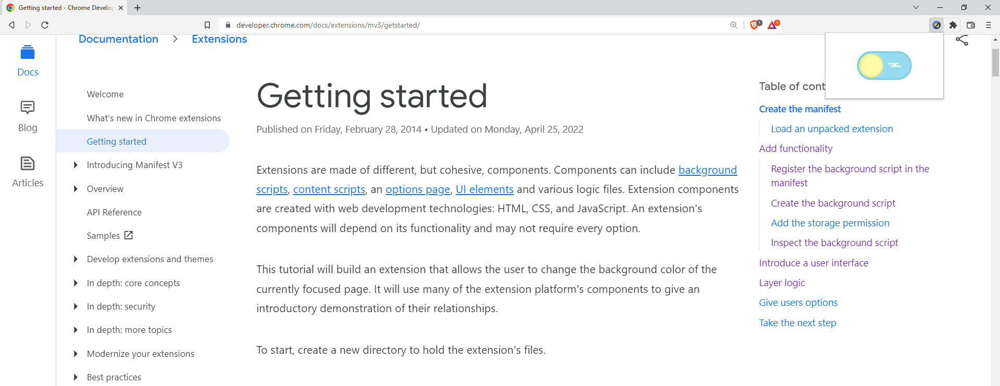
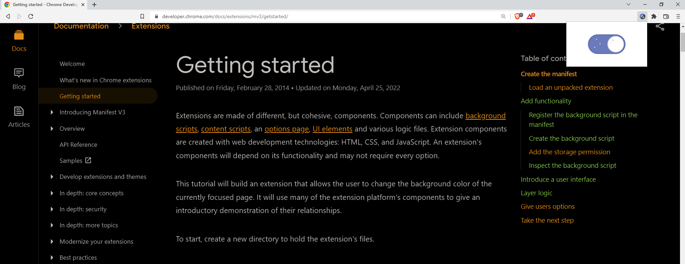

# Chrome extension - Invert Page Colors

This chrome extension inverts page colors, to reduce eye strain in low light conditions.

# Demo

# Installation

1. Download this project to your machine
2. Open your chrome browser and click on the hamburger menu
3. In the dropdown menu that opens, select "Extensions"
4. Select "Load unpacked", and in the file manager that opens, select the folder from step 1
5. Pin the extension to taskbar (optional)
6. Open a webpage and click on the extension icon to toggle state

# TODO

* Add state to toggle animation on (open on correct mode on extension click)
* Apply inverted colors on new tabs
* Publish extension on chrome web store

# Credits

* <a href="https://www.flaticon.com/free-icons/night" title="night icons">Night icons created by Freepik - Flaticon</a>
* Day and night toggle animation taken from https://freefrontend.com/css-toggle-switches/